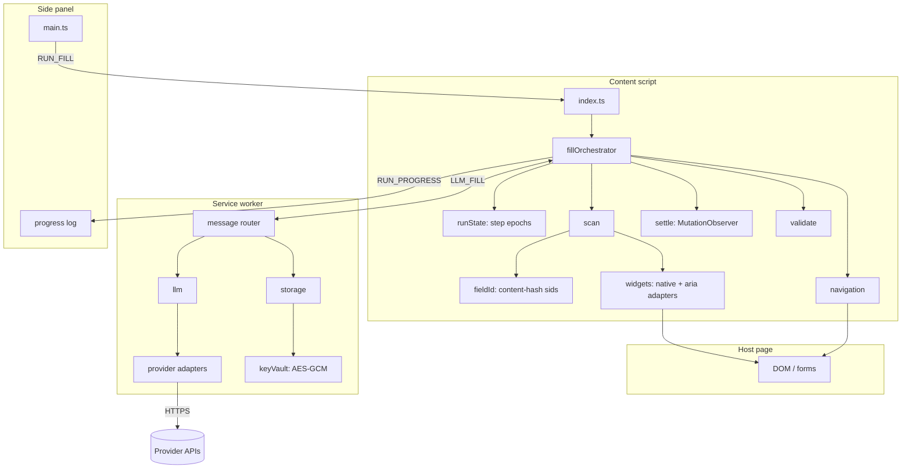
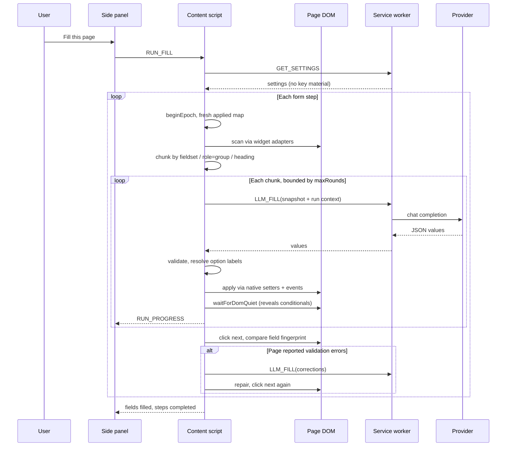

# AI Form Filler

Chrome extension (Manifest V3) that fills web forms with realistic synthetic data for frontend and QA workflows. It is built for the two cases naive fillers get wrong: **framework-controlled inputs** that silently revert direct writes, and **multi-step wizards** whose fields depend on earlier answers.

[](https://developer.chrome.com/docs/extensions/mv3/intro/)
[](https://www.typescriptlang.org/)
[](https://vitejs.dev/)

## Contents

- [Overview](#overview)
- [Capabilities](#capabilities)
- [Architecture](#architecture)
- [Fill workflow](#fill-workflow)
- [Why reactive forms need special handling](#why-reactive-forms-need-special-handling)
- [Multi-step navigation](#multi-step-navigation)
- [Custom requests and language](#custom-requests-and-language)
- [Configuration](#configuration)
- [LLM providers](#llm-providers)
- [Security and storage](#security-and-storage)
- [Project layout](#project-layout)
- [Development](#development)
- [Regression fixture](#regression-fixture)

## Overview

Manual form testing is slow and brittle: labels change, wizards add steps, and framework-controlled inputs ignore naive value assignment. AI Form Filler runs inside the page, discovers fillable controls through widget adapters, resolves what it can locally, and delegates the rest to a configured LLM through the background service worker. Every write goes through the DOM's native property setters and a realistic event sequence, which is what React, Vue, Svelte, and Angular actually listen for.

The run is stateful. A step epoch scopes what has been filled, and a semantic run context carries facts and identity values forward, so a step-4 "confirm your email" matches the address entered in step 1.

## Capabilities

| Area | Behavior |
| --- | --- |
| Fill modes | **Hybrid** (heuristics then AI), **AI only**, or **Heuristics only** (no API key required) |
| Triggers | Side panel button, context menu, keyboard shortcut (`Alt+Shift+F`) |
| Native controls | Text inputs, textareas, selects, radio groups, checkboxes |
| ARIA widgets | `role="checkbox"`, `role="switch"`, `role="radiogroup"`, `role="combobox"` / `listbox`, `contenteditable` |
| Multi-step forms | Automatic advancing with content-fingerprint step detection, up to 50 steps |
| Conditional fields | `MutationObserver` settling picks up fields revealed by a checkbox or select |
| Error recovery | Reads the page's own validation messages and re-asks the model with them quoted |
| Custom requests | One free-text box for user rules, injected at highest prompt priority |
| Multilingual | Follows the page's language, or an explicit BCP-47 override, with per-field `lang` support |
| Providers | OpenAI, Anthropic, Google AI Studio, xAI, Groq, OpenRouter, Cerebras |
| Live progress | Streamed to the side panel while the run is in flight |

## Architecture

Work is split across isolated Chrome contexts. The content script owns DOM access and orchestration; the service worker owns credentials and all outbound HTTP; the side panel is configuration, the custom request box, and the progress log.



### Runtime contexts

| Context | Entry point | Responsibility |
| --- | --- | --- |
| Content script | `src/content/index.ts` | Owns the DOM. Scans, applies, validates, navigates, streams progress |
| Service worker | `src/background/index.ts` | Message router. Holds keys, builds prompts, performs all network calls |
| Side panel | `src/sidepanel/main.ts` | Provider and model config, custom request, run trigger, live log |

The page never sees an API key: the content script asks the worker for values and receives only the values back.

## Fill workflow



## Why reactive forms need special handling

Three distinct problems, each addressed by a specific mechanism:

**1. Frameworks revert direct writes.** React installs an instance-level `value` property to track changes. Assigning `el.value = x` updates that tracker too, so the `input` event that follows looks like a no-op and React restores its own state. Writes therefore go through the prototype's setter:

```20:31:src/content/widgets/dom.ts
export function setNativeValue(el: HTMLElement, value: string): void {
  const descriptor =
    Object.getOwnPropertyDescriptor(Object.getPrototypeOf(el) as object, "value") ??
    Object.getOwnPropertyDescriptor(HTMLInputElement.prototype, "value");
  if (descriptor?.set) descriptor.set.call(el, value);
  else (el as HTMLInputElement).value = value;
}
```

Every apply verifies the result afterwards and reports failure rather than assuming success.

**2. DOM nodes are recycled between steps.** React reuses the same `<input>` elements across wizard steps, so identity derived from the element alone makes step 2 inherit step 1's recorded values — the run then sees nothing left to fill and exits. Synthetic ids are instead `s{epoch}_{hash}`, where the hash covers structural path, `name`, `id`, label text, control type and option signature, and the epoch increments on every step change. A recycled node cannot collide with a previous step's state, because crossing a step boundary starts a fresh applied map rather than pruning the old one.

Framework-generated identifiers (`:r3:`, `mui-1234`, `radix-…`) are excluded from the hash, since they change on every mount.

**3. Option values are not option labels.** For `<option value="13">Tokyo</option>`, a model told only about `"13"` has nothing to reason with; told about `Tokyo`, it answers `"Tokyo"`, which exact-value comparison then rejects. Prompts now carry `[value, label]` pairs, and `resolveOptionValue` matches from strictest to loosest — exact value, exact label, NFKC/case/punctuation-normalized, then unique containment — refusing to guess when a loose match is ambiguous.

## Multi-step navigation

Step change is detected by a **content fingerprint** of the visible field set (labels, kinds, option counts) plus URL and active step-indicator text. Synthetic ids are deliberately not part of it: they are namespaced per step and would report a change on every scan.

Forward controls are ranked by multilingual label markers, position, and membership of the active form; back, cancel and reset controls are scored out. Final-submit controls (pay, place order, checkout) are only clicked when explicitly allowed, which by default they are not — the run stops with the form filled and the last click left to you.

When a click does not change the fingerprint, the page is inspected for `aria-invalid`, `aria-errormessage`, and `role="alert"` text. Those messages are quoted back to the model as a `corrections` block for a repair round, then the click is retried once.

## Custom requests and language

The side panel has a single free-text box, empty by default. Anything entered is injected into the prompt as a clearly delimited block:

```
USER RULES (highest priority, override anything above that conflicts):
Phone as 090-XXXX-XXXX. User names in Japanese.
```

It is carried into every chunk and into the navigation call, so it applies uniformly across a long form.

Language resolution has three levels, most specific first:

1. A field's own `lang` attribute, collected during the scan.
2. An explicit BCP-47 override, when **Value language** is set to *Always use…*.
3. The page's `<html lang>`, otherwise the browser locale.

## Configuration

Settings live in `chrome.storage.local` under `aff_settings` and are sanitized on every read.

| Setting | Meaning |
| --- | --- |
| `provider` / `baseUrl` / `model` | Selected provider, endpoint, and model |
| `fillMode` | `hybrid`, `ai_only`, or `heuristics_only` |
| `fillLanguage` / `fillLocaleOverride` | Follow the page, or force a BCP-47 locale |
| `customRequest` | Free-text user rules, empty by default |
| `maxRounds` | Chunk attempts per step (1–20) |
| `settleMs` | Extra delay after writes, on top of mutation-based settling |
| `autoNextEnabled` / `autoNextMaxSteps` | Automatic advancing, capped at 50 steps |
| `fillEmptyOnly` | Skip fields that already hold a value |
| `rememberKeyAcrossRestarts` | Persist keys, or drop them on browser start |
| `fallbackProviders` | Opt-in providers to try if the selected one fails |
| `encryptKeys` | Encrypt stored keys at rest behind a passphrase |

## LLM providers

| Provider | Kind | Default model |
| --- | --- | --- |
| OpenAI | OpenAI-compatible | `gpt-4o-mini` |
| Anthropic | Anthropic messages | `claude-3-5-haiku-latest` |
| Google AI Studio | OpenAI-compatible | `gemini-2.0-flash` |
| xAI | OpenAI-compatible | `grok-3-mini` |
| Groq Cloud | OpenAI-compatible | `llama-3.3-70b-versatile` |
| OpenRouter | OpenAI-compatible | `openrouter/auto` |
| Cerebras | OpenAI-compatible | `llama-3.3-70b` |

Anthropic differs enough to need its own adapter: `POST /v1/messages`, an `x-api-key` header, `anthropic-version`, a top-level `system` string, a mandatory `max_tokens`, and content returned as a block array. The `kind` discriminator on each provider selects the request builder and response reader.

**Only the selected provider is contacted.** Fallbacks are opt-in and listed explicitly, because a fallback means shipping the scraped form contents to another vendor. Every provider origin is declared in `host_permissions`, so a mistyped base URL cannot receive a key.

Within a provider, a failed request walks the configured model, then the provider's default, then its fallback list, and steps down through decreasing output-token budgets when a request is rejected as too large. Authentication failures and the per-chunk request budget stop the walk immediately, since neither improves with another model.

## Security and storage

- API keys live in extension storage and are read only by the service worker. Web pages, including the page being filled, never receive them.
- The worker reports key **presence** and encryption state to the UI, never key material, and nothing key-derived is logged.
- `rememberKeyAcrossRestarts: false` keeps keys in a separate bucket that is cleared on `chrome.runtime.onStartup`.
- With `encryptKeys` enabled, keys are wrapped with AES-GCM under a PBKDF2-derived key (250k iterations, SHA-256, random per-profile salt). The derived key is held in `chrome.storage.session`, so it survives service-worker restarts but not a browser restart. Off by default.
- Filling only ever starts from an explicit user action, never on page load.
- Anyone with access to the browser profile can use a stored key. Encryption raises the bar for at-rest access; it is not a defence against a compromised profile in use.

## Project layout

```
ai-form-filler/
├── manifest.config.ts        # MV3 manifest; host_permissions from the provider list
├── fixtures/                 # Local React wizard used as the regression check
│   ├── wizard.jsx
│   └── vite.config.ts
├── _locales/{en,de}/         # UI strings
└── src/
    ├── background/
    │   ├── index.ts          # Message router, lifecycle, context menu
    │   ├── llm.ts            # Prompts, model discovery, provider walk
    │   ├── storage.ts        # Settings and key persistence
    │   └── keyVault.ts       # Optional AES-GCM encryption at rest
    ├── content/
    │   ├── index.ts          # RUN_FILL listener, progress streaming
    │   ├── fillOrchestrator.ts # Step and round state machine
    │   ├── runState.ts       # Step epochs, applied values, run context
    │   ├── fieldId.ts        # Content-hash synthetic ids
    │   ├── scan.ts           # Adapter-driven DOM scan
    │   ├── chunking.ts       # DOM-structure grouping
    │   ├── apply.ts          # Batch writes, drift reconciliation
    │   ├── validate.ts       # Model output validation
    │   ├── settle.ts         # MutationObserver settling
    │   ├── navigation.ts     # Step detection and advancing
    │   ├── candidates.ts     # Unresolved-field selection
    │   └── widgets/          # native.ts, aria.ts, dom.ts adapters
    ├── shared/
    │   ├── types.ts          # Settings, descriptors, messages
    │   ├── providers.ts      # Provider catalog and request shaping
    │   ├── optionMatch.ts    # Option and boolean resolution
    │   ├── heuristics.ts     # Network-free value generation
    │   ├── fillable.ts       # Fillability rules
    │   └── llmResponseSchema.ts # Response parsing
    └── sidepanel/            # index.html, main.ts, sidepanel.css
```

## Development

```bash
npm install
npm run build      # tsc --noEmit && vite build
npm run dev        # rebuild on change
npm run check      # typecheck only
```

Load the extension from `dist/` via `chrome://extensions` → **Load unpacked**. Click the toolbar icon to open the side panel.

Adding support for a new widget family means writing one adapter with `match` / `describe` / `read` / `apply` in `src/content/widgets/` and registering it in `widgets/index.ts`. ARIA adapters are registered before native ones, so a `role="combobox"` input is driven as a combobox rather than as plain text.

## Regression fixture

```bash
npm run fixture    # serves http://localhost:5174
```

`fixtures/wizard.jsx` is a four-step React form built to reproduce each failure mode this extension addresses:

- The same component shape on every step, so React recycles the identical input nodes.
- Fully controlled inputs, which revert any write the framework did not observe.
- A text field that only renders once a checkbox is checked.
- A radio group whose values (`spd_exp`) differ from its labels (`Express (next day)`).
- A native select with numeric values (`13`) and human labels (`Tokyo`).
- An ARIA combobox and an ARIA switch with no native control behind them.
- A phone field with a `pattern` that generic test data fails, forcing a repair round.
- A step-4 email confirmation that must match the step-1 value.

The fixture lists its own pass criteria on screen. Run against it after any change to the scan, apply, or navigation paths.
