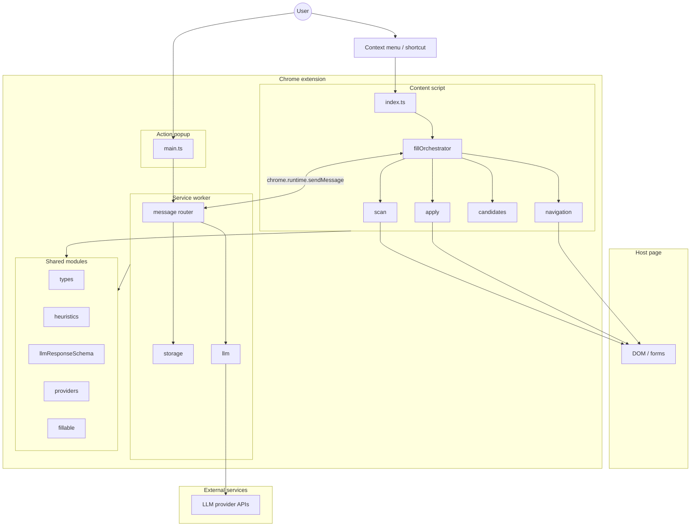
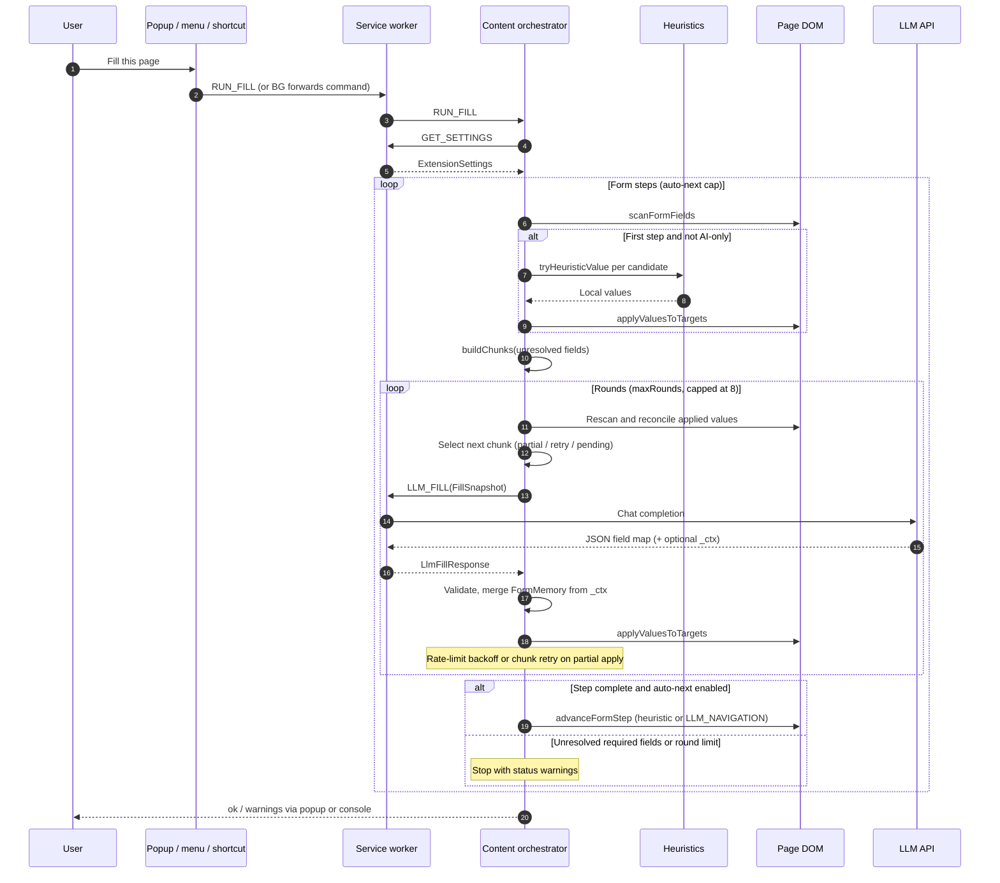
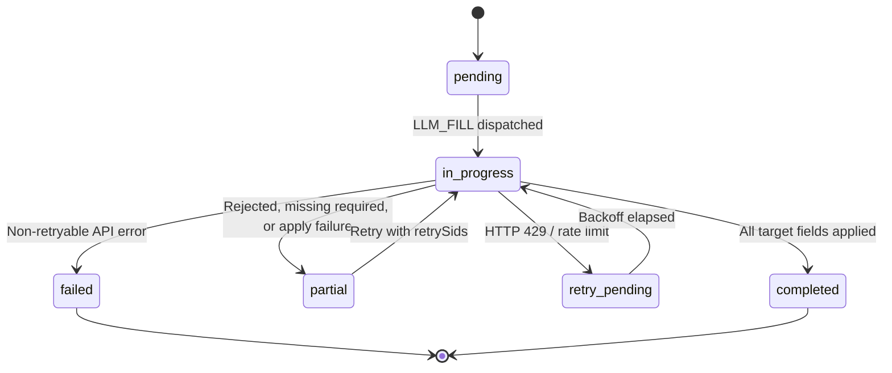
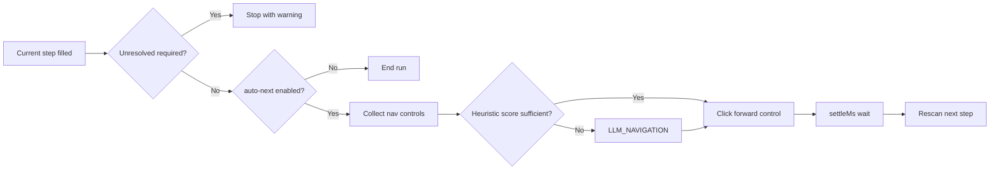

# AI Form Filler

Chrome extension (Manifest V3) that fills web forms for frontend and QA workflows. It combines fast, local heuristics with LLM-backed inference for complex controls, conditional fields, and multi-step wizards.

[](https://developer.chrome.com/docs/extensions/mv3/intro/)
[](https://www.typescriptlang.org/)
[](https://vitejs.dev/)

## Contents

- [Overview](#overview)
- [Capabilities](#capabilities)
- [Architecture](#architecture)
- [Runtime contexts](#runtime-contexts)
- [Fill workflow](#fill-workflow)
- [Field resolution](#field-resolution)
- [Multi-step navigation](#multi-step-navigation)
- [Configuration](#configuration)
- [LLM providers](#llm-providers)
- [Security and storage](#security-and-storage)
- [Project layout](#project-layout)
- [Development](#development)

## Overview

Manual form testing is slow and brittle: labels change, wizards add steps, and framework-controlled inputs ignore naive value assignment. AI Form Filler runs in the page, discovers fillable controls, resolves values locally when possible, and delegates the rest to a configured LLM through a background service worker. Results are applied with DOM events that React, Vue, and similar stacks typically listen for.

The extension is built for repeatability. Optional persona settings keep identity-like fields consistent across runs, while orchestration settings (round limits, settle delays, empty-only filling) make behavior predictable in CI-adjacent manual testing.

## Capabilities

| Area | Behavior |
| --- | --- |
| Fill modes | **Hybrid** (heuristics then AI), **AI only**, or **Heuristics only** (no API key required) |
| Triggers | Popup action, context menu, keyboard shortcut (`Alt+Shift+F`) |
| Field coverage | Inputs, textareas, selects, radios, and checkboxes with label, ARIA, autocomplete, and surrounding-text context |
| Multi-step forms | Heuristic and AI-assisted navigation across wizard steps with configurable step caps |
| Persona | Optional email, name, phone, and extended JSON for consistent synthetic data |
| Providers | OpenRouter, Groq, Google AI Studio, and Cerebras via OpenAI-compatible chat APIs |
| Internationalization | English and German UI strings via `_locales` |

## Architecture

The extension splits work across isolated Chrome contexts. The content script owns DOM access and orchestration; the service worker owns credentials, settings, and outbound HTTP; the popup is configuration and manual trigger only.



### Design principles

- **Page-local orchestration** keeps scan, apply, and navigation synchronous with DOM updates and framework re-renders.
- **Background-only network** keeps API keys out of page JavaScript and aligns with extension host permissions.
- **Shared contracts** (`types`, Zod-backed parsing, heuristics) keep content and background behavior aligned.
- **Chunked AI requests** group fields by priority and section so prompts stay focused and retries are scoped.

## Runtime contexts

| Context | Entry | Responsibility |
| --- | --- | --- |
| Content script | `src/content/index.ts` | Listens for `RUN_FILL`, loads settings, runs `runFillOrchestration`, serializes concurrent fills per tab |
| Service worker | `src/background/index.ts` | Settings and API key CRUD, context menu, command shortcut, `LLM_FILL` / `LLM_NAVIGATION` proxies |
| Popup | `src/popup/main.ts` | Provider, model, fill mode, persona, orchestration toggles; sends fill to active tab |
| Shared | `src/shared/*` | Types, fillability rules, heuristics, provider catalog, LLM response parsing |

### Message surface (content ↔ background)

| Message | Direction | Purpose |
| --- | --- | --- |
| `GET_SETTINGS` | Content / popup → background | Merged settings plus key presence hints |
| `SAVE_SETTINGS` / `SAVE_API_KEY` / `CLEAR_API_KEY` | Popup → background | Persist configuration |
| `GET_PROVIDER_MODELS` / `TEST_API_KEY` | Popup → background | Model list and connectivity check |
| `LLM_FILL` | Content → background | Field-level inference from a `FillSnapshot` |
| `LLM_NAVIGATION` | Content → background | Next-control selection from a `NavigationSnapshot` |
| `RUN_FILL` | Background / popup → content | Start orchestration on the active tab |

## Fill workflow

A fill run is an outer **form-step loop** (for wizards) containing an inner **round loop** (for dynamic DOM and chunk retries). Heuristic resolution runs once on the first step when the mode is not AI-only.



### Chunk lifecycle

Unresolved fields are bucketed (required identity/contact/payment, optional priority, then thematic sections). Each bucket becomes a chunk processed by a small state machine so partial LLM results can retry without re-filling successful controls.



## Field resolution

### Scan (`src/content/scan.ts`)

Walks the document, assigns stable synthetic IDs per element, and builds `FieldDescriptor` records: tag, input type, labels, placeholders, ARIA, options, radio groups, visibility, required hints, and locale. `fillable.ts` excludes non-fillable input types (for example file, hidden, submit).

### Heuristics (`src/shared/heuristics.ts`)

Runs without network access. Matches autocomplete tokens, input types, and label patterns; generates plausible values; respects persona overrides; and skips payment, password, select, radio, and checkbox groups (routed to AI in hybrid mode).

### AI fill (`src/background/llm.ts`)

Builds provider-specific prompts from the snapshot, including chunk section, optional `FormMemory` context, checkbox-group cardinality rules, and retry-only field subsets. Responses are parsed through `llmResponseSchema.ts`. Optional `_ctx` in the model output merges into session **FormMemory** so later chunks stay coherent (for example job category before salary sections).

### Apply (`src/content/apply.ts`)

Writes values and dispatches `input` and `change` events. Checkboxes and radios use dedicated paths; `reconcileAppliedValues` re-reads the DOM after framework updates.

### Candidates (`src/content/candidates.ts`)

Defines **unresolved** fields: not yet applied on the DOM, or non-empty when `fillEmptyOnly` is enabled.

## Multi-step navigation

`src/content/navigation.ts` collects visible buttons and submit-like controls, scores forward/back/final markers across locales, and either clicks heuristically or requests `LLM_NAVIGATION` when confidence is low. `autoNextEnabled` and `autoNextMaxSteps` bound how far a run advances; final submit clicks are gated by `allowFinalSubmit` derived from settings.



## Configuration

Settings are stored in `chrome.storage.local` (`aff_settings`) and surfaced in the popup.

| Setting | Role |
| --- | --- |
| `fillMode` | `hybrid`, `ai_only`, or `heuristics_only` |
| `provider` / `baseUrl` / `model` | Active LLM endpoint and model id |
| `personaJson` | Optional identity JSON for heuristics and prompts |
| `maxRounds` | Inner retry loop per form step (clamped to 8 in orchestrator) |
| `settleMs` | Delay after DOM writes before rescan |
| `autoNextEnabled` / `autoNextMaxSteps` | Wizard advancement |
| `fillEmptyOnly` | Skip fields that already have values |
| `rememberKeyAcrossRestarts` | Persist API keys in `local` vs ephemeral session storage |

Fill language policy is currently fixed to **auto** at read time: locale is inferred from the document and field metadata during scan.

## LLM providers

| Provider | Default base URL | Notes |
| --- | --- | --- |
| OpenRouter | `https://openrouter.ai/api/v1` | Free model list fetched when a key is present |
| Groq | `https://api.groq.com/openai/v1` | Static fallback model list |
| Google AI Studio | `https://generativelanguage.googleapis.com/v1beta/openai` | Gemini via OpenAI-compatible surface |
| Cerebras | `https://api.cerebras.ai/v1` | Static fallback model list |

Host permission in the manifest is declared for OpenRouter; other providers use their public API origins from configured base URLs.

## Security and storage

- API keys never enter content scripts; only the service worker reads them for `fetch`.
- Keys can persist in `chrome.storage.local` or an ephemeral map cleared on browser startup when “remember across restarts” is off.
- The popup exposes key prefixes for confirmation, not full secrets.
- Filling runs only on user action (popup, context menu, or shortcut), not on arbitrary page load.

## Project layout

```text
ai-form-filler/
├── manifest.config.ts       # MV3 manifest (permissions, commands, content scripts)
├── vite.config.ts           # Vite + @crxjs/vite-plugin
├── _locales/                # en, de extension strings
├── public/                    # Static assets
└── src/
    ├── background/
    │   ├── index.ts         # Message router, menus, commands
    │   ├── llm.ts           # Provider HTTP, prompts, parsing
    │   └── storage.ts       # Settings and API key persistence
    ├── content/
    │   ├── index.ts         # RUN_FILL entrypoint
    │   ├── fillOrchestrator.ts
    │   ├── scan.ts
    │   ├── apply.ts
    │   ├── navigation.ts
    │   └── candidates.ts
    ├── popup/
    │   ├── index.html
    │   ├── main.ts
    │   └── popup.css
    └── shared/
        ├── types.ts
        ├── providers.ts
        ├── heuristics.ts
        ├── personaSettings.ts
        ├── fillable.ts
        └── llmResponseSchema.ts
```

## Development

### Prerequisites

- Node.js 18+
- npm
- Google Chrome or Chromium

### Scripts

| Command | Description |
| --- | --- |
| `npm run dev` | Production build in watch mode; reload the unpacked extension after changes |
| `npm run build` | Typecheck (`tsc --noEmit`) and production bundle to `dist/` |
| `npm run check` | Typecheck only |

### Load unpacked

1. `npm install`
2. `npm run dev` or `npm run build`
3. Open `chrome://extensions`, enable **Developer mode**, **Load unpacked**, select the `dist` directory
4. Configure a provider API key in the popup for hybrid or AI-only modes
5. Open a form page and use **Fill this tab**, the context menu, or `Alt+Shift+F`

### Tech stack

- [Vite](https://vitejs.dev/) 6 and [@crxjs/vite-plugin](https://crxjs.dev/) for MV3 bundling
- [TypeScript](https://www.typescriptlang.org/) 5
- [Zod](https://zod.dev/) for structured LLM response validation (where used alongside custom parsers)

---

Built for repeatable form testing without sacrificing control over data, providers, and orchestration limits.
